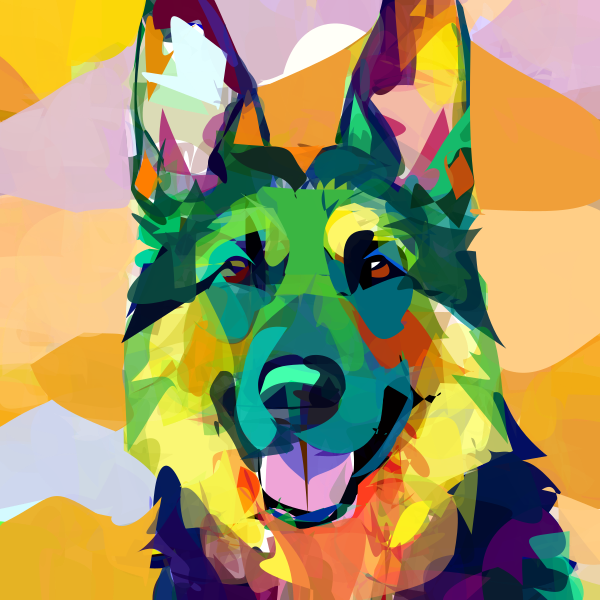
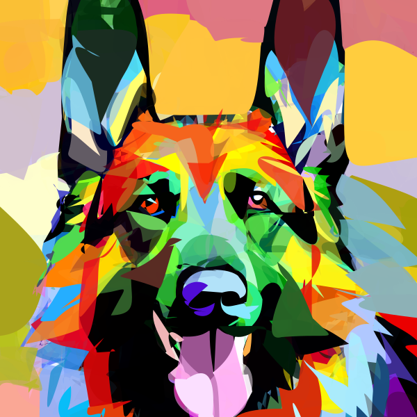
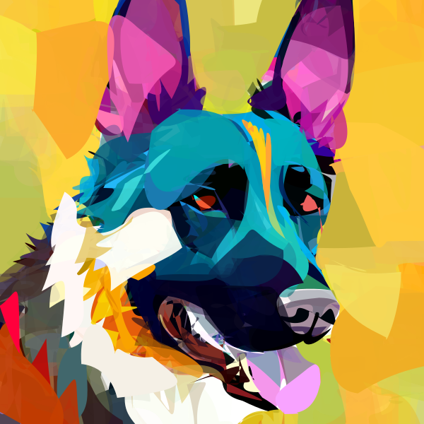
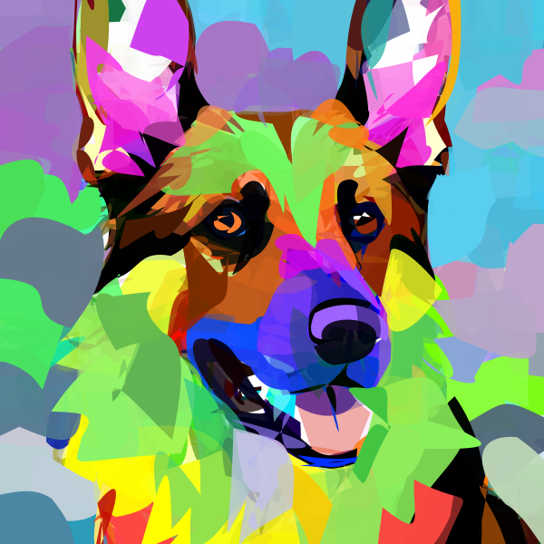
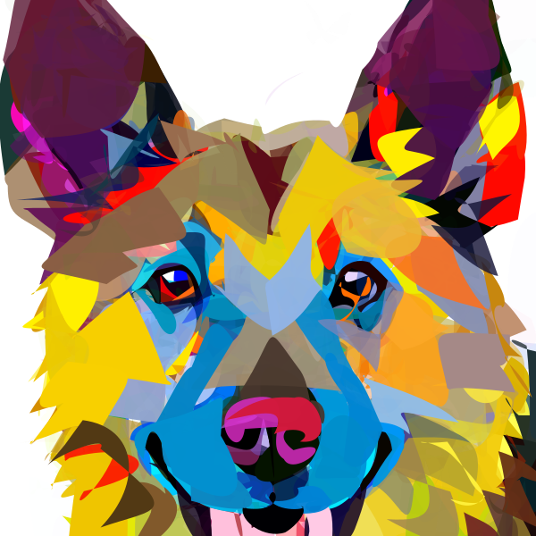
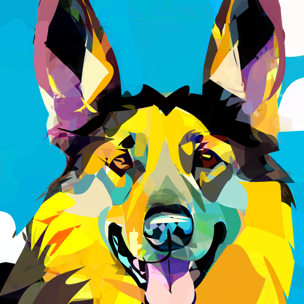
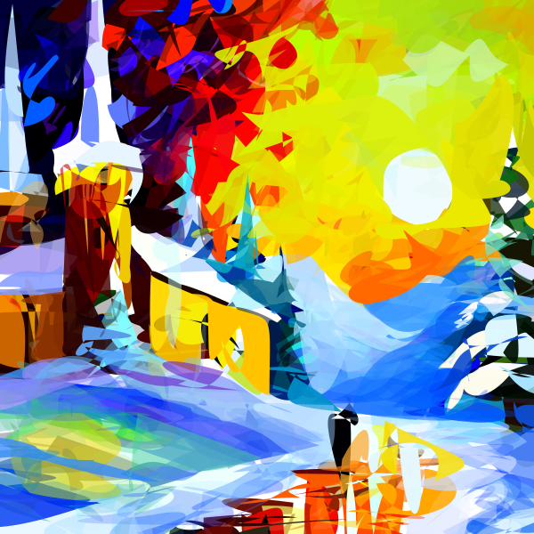

# Qualitative Results

### Case: German shepherd

**Prompt:** A colorful German shepherd in vector art. tending on artstation <br/>
**style:** Iconography <br/>
**Preview:**

|                           Particle 1                           |                           Particle 2                           |                           Particle 3                           |                          Particle 4                          |                           Particle 5                           |                           Particle 6                           |
|:--------------------------------------------------------------:|:--------------------------------------------------------------:|:--------------------------------------------------------------:|:------------------------------------------------------------:|:--------------------------------------------------------------:|:--------------------------------------------------------------:|
|  |  |  |  |  |  |

**Script:**

```shell
python svgdreamer.py x=iconography "prompt='A colorful German shepherd in vector art. tending on artstation.'" result_path='./logs/GermanShepherd' seed=26226
```

### Case: German shepherd

**Prompt:** A colorful German shepherd in vector art. tending on artstation <br/>
**style:** Iconography <br/>
**Preview:**

|                         Particle 1                         |                         Particle 2                         |                         Particle 3                         |                        Particle 4                        |                         Particle 5                         |                         Particle 6                         |
|:----------------------------------------------------------:|:----------------------------------------------------------:|:----------------------------------------------------------:|:--------------------------------------------------------:|:----------------------------------------------------------:|:----------------------------------------------------------:|
|  |  |  |  |  |  |

**Script:**

```shell
python svgdreamer.py x=iconography "prompt='a beautiful snow-covered castle, a stunning masterpiece, trees, rays of the sun, Leonid Afremov'" result_path='./logs/SnowCastle' seed=116740
```
