# Qualitative Results

### Case: German shepherd

**Prompt:** A colorful German shepherd in vector art. tending on artstation <br/>
**style:** Iconography <br/>
**Preview:**

|                           Particle 1                           |                           Particle 2                           |                           Particle 3                           |                          Particle 4                          |                           Particle 5                           |                           Particle 6                           |
|:--------------------------------------------------------------:|:--------------------------------------------------------------:|:--------------------------------------------------------------:|:------------------------------------------------------------:|:--------------------------------------------------------------:|:--------------------------------------------------------------:|
|  |  |  |  |  |  |

**Script:**

```shell
python svgdreamer.py x=iconography "prompt='A colorful German shepherd in vector art. tending on artstation.'" result_path='./logs/GermanShepherd' seed=26226
```

### Case: Snow-Covered Castle

**Prompt:** a beautiful snow-covered castle, a stunning masterpiece, trees, rays of the sun, Leonid Afremov <br/>
**style:** Iconography <br/>
**Preview:**

|                         Particle 1                         |                         Particle 2                         |                         Particle 3                         |                        Particle 4                        |                         Particle 5                         |                         Particle 6                         |
|:----------------------------------------------------------:|:----------------------------------------------------------:|:----------------------------------------------------------:|:--------------------------------------------------------:|:----------------------------------------------------------:|:----------------------------------------------------------:|
|  |  |  |  |  |  |

**Script:**

```shell
python svgdreamer.py x=iconography "prompt='a beautiful snow-covered castle, a stunning masterpiece, trees, rays of the sun, Leonid Afremov'" result_path='./logs/SnowCastle' seed=116740
```

### Case: Vector Wolf

**Prompt:** wolf. low poly. minimal flat 2d vector. lineal color. trending on artstation. <br/>
**style:** Low-Poly <br/>
**Preview:**

|                       Particle 1                        |                       Particle 2                        |                       Particle 3                        |                      Particle 4                       |                       Particle 5                        |                       Particle 6                        |
|:-------------------------------------------------------:|:-------------------------------------------------------:|:-------------------------------------------------------:|:-----------------------------------------------------:|:-------------------------------------------------------:|:-------------------------------------------------------:|
| 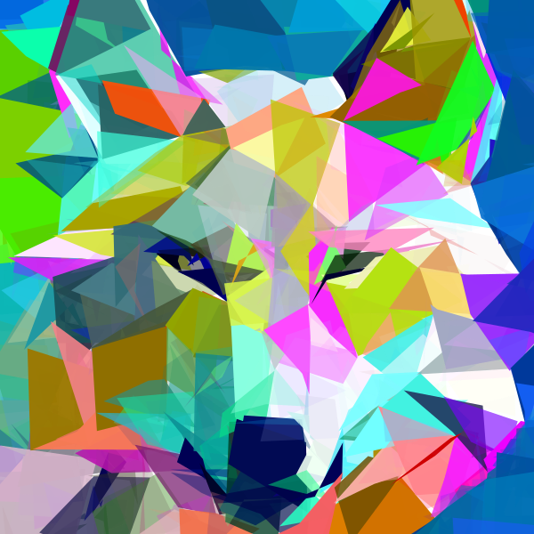 | 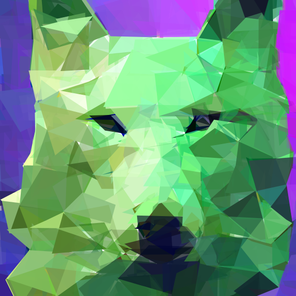 | 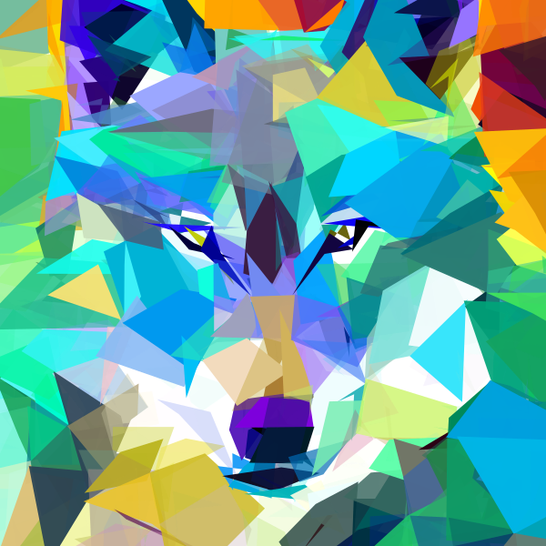 | 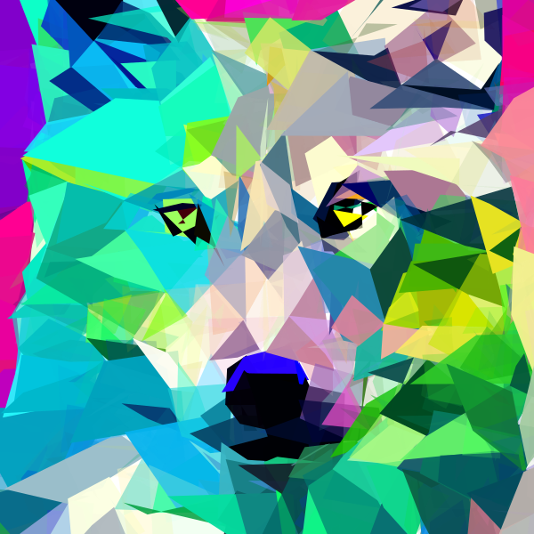 | 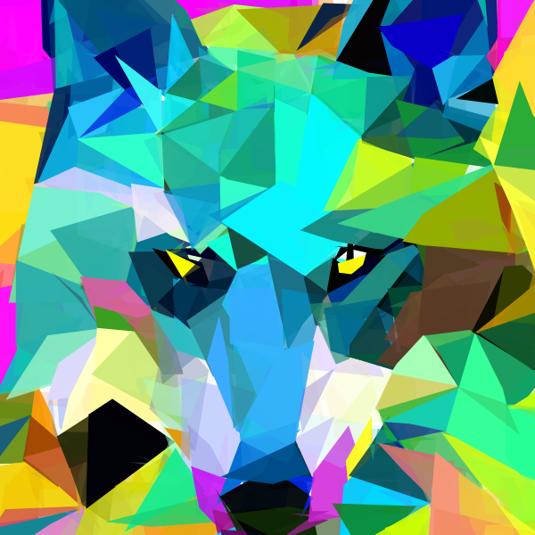 | 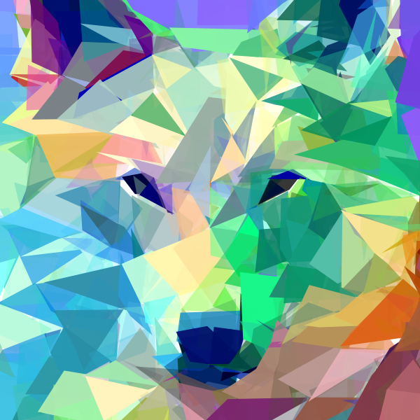 |

**Script:**

```shell
python svgdreamer.py x=lowpoly "prompt='wolf. low poly. minimal flat 2d vector. lineal color. trending on artstation.'" neg_prompt='' result_path='./logs/Wolf' seed=670488
```

### Case: Scarlet Macaw

**Prompt:** A picture of a scarlet macaw, low-ploy, polygon, minimal flat 2d vector <br/>
**style:** Low-Poly <br/>
**Preview:**

|                           Particle 1                            |                           Particle 2                            |                           Particle 3                            |                          Particle 4                           |                           Particle 5                            |                           Particle 6                            |
|:---------------------------------------------------------------:|:---------------------------------------------------------------:|:---------------------------------------------------------------:|:-------------------------------------------------------------:|:---------------------------------------------------------------:|:---------------------------------------------------------------:|
| 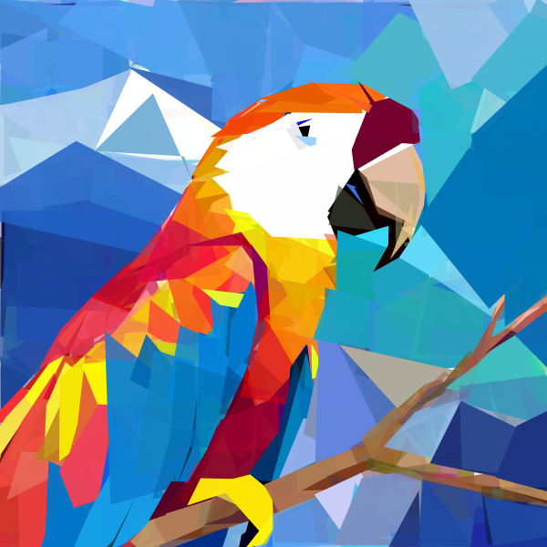 | 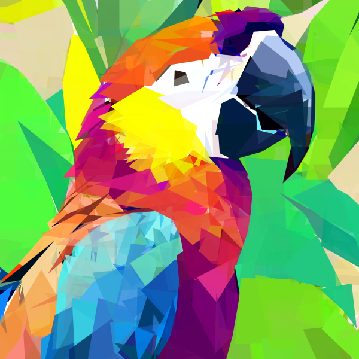 | 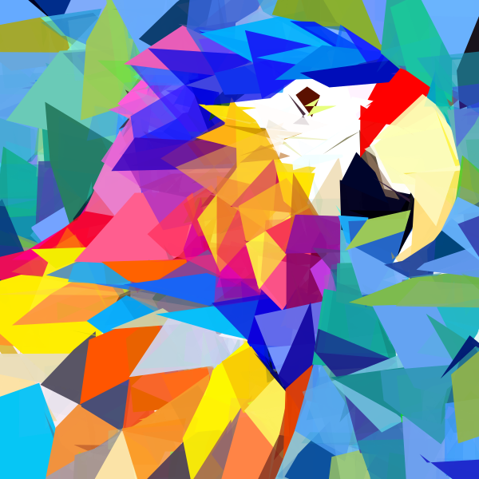 | 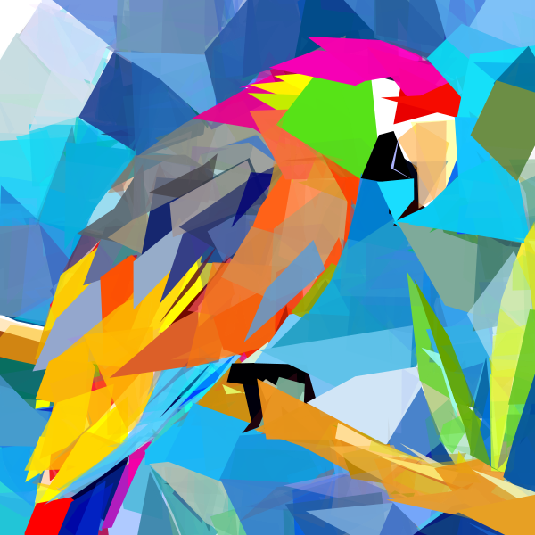 | 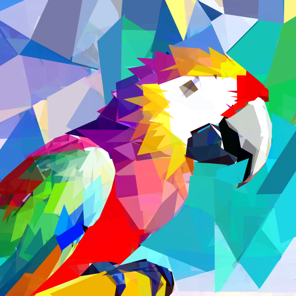 | 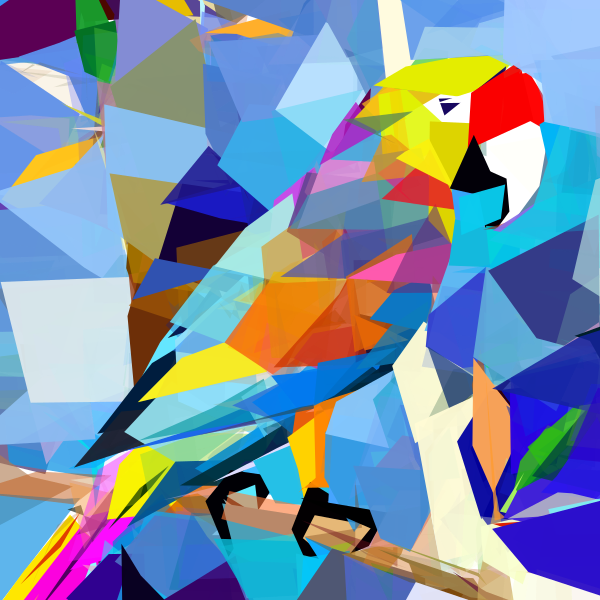 |

**Script:**

```shell
python svgdreamer.py x=lowpoly "prompt='A picture of a scarlet macaw, low-ploy, polygon, minimal flat 2d vector'" "neg_prompt='unrealistic, blurry, low quality, out of focus, ugly, low contrast, dull, low res, low-resolution, oversaturation, worst quality, normal quality, text, watermark, logo, banner, extra digits, cropped, jpeg artifacts, signature, username, error, sketch ,duplicate, monochrome, horror, geometry, mutation, disgusting'" save_step=50 result_path='.log/ScarletMacaw'
```

### Case: Polar Bear

**Prompt:** polar bear. low poly. minimal flat 2d vector. lineal color. trending on artstation. <br/>
**style:** Low-Poly <br/>
**Preview:**

|                          Particle 1                          |                          Particle 2                          |                          Particle 3                          |                         Particle 4                         |                          Particle 5                          |                          Particle 6                          |
|:------------------------------------------------------------:|:------------------------------------------------------------:|:------------------------------------------------------------:|:----------------------------------------------------------:|:------------------------------------------------------------:|:------------------------------------------------------------:|
| 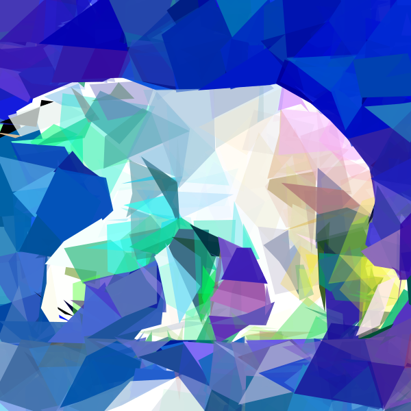 | 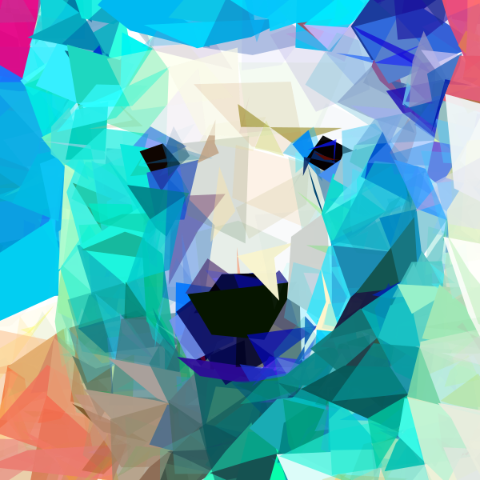 | 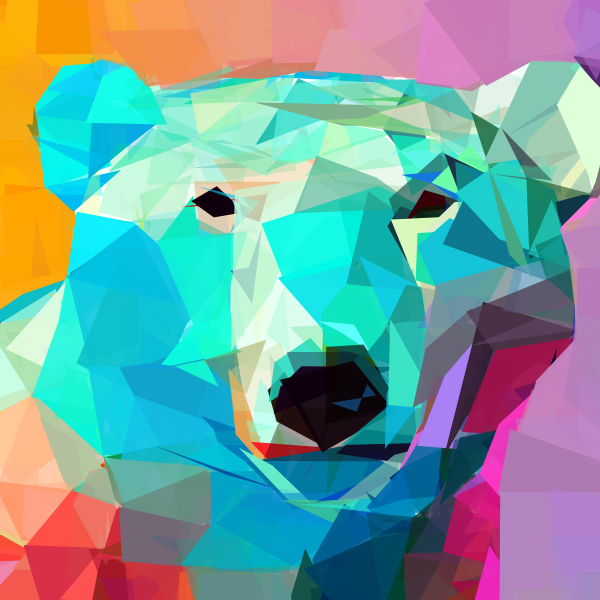 | 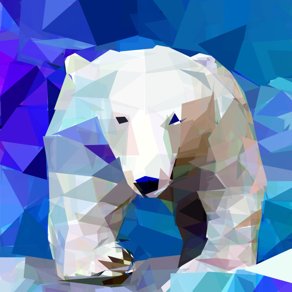 | 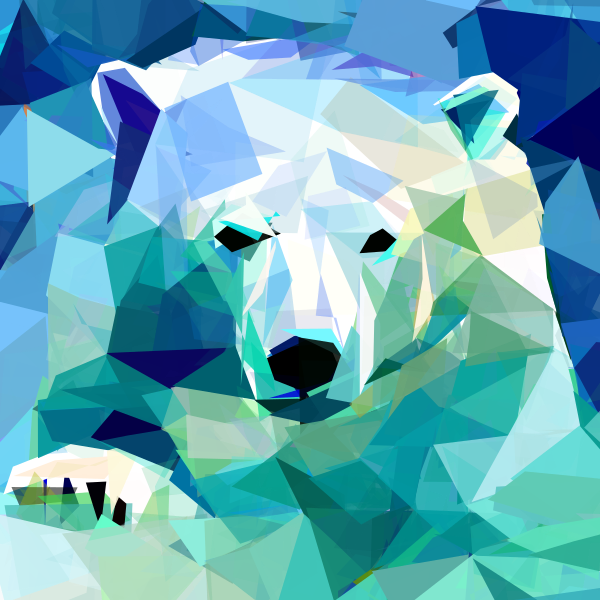 | 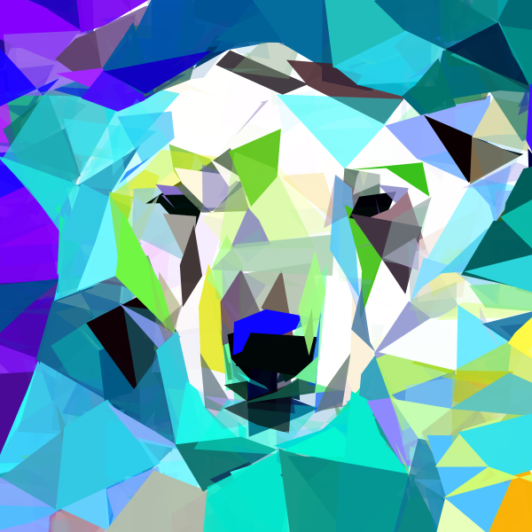 |

**Script:**

```shell
python svgdreamer.py x=lowpoly "prompt='polar bear. low poly. minimal flat 2d vector. lineal color. trending on artstation.'" "neg_prompt='unrealistic, blurry, low quality, out of focus, ugly, low contrast, dull, low res, low-resolution, oversaturation, worst quality, normal quality, text, watermark, logo, banner, extra digits, cropped, jpeg artifacts, signature, username, error, sketch ,duplicate, monochrome, horror, geometry, mutation, disgusting'" save_step=50 result_path='.log/PolarBear'
```

### Others

````shell
python svgdreamer.py x=painting "prompt='self portrait of Van Gogh. oil painting. cmyk portrait. multi colored. defiant and beautiful. cmyk. expressive eyes.'" x.num_paths=256 result_path='./logs/VanGogh-Portrait'
python svgdreamer.py x=lowpoly "prompt='A picture of a scarlet macaw, low-ploy, polygon, minimal flat 2d vector'" "neg_prompt='unrealistic, blurry, low quality, out of focus, ugly, low contrast, dull, low res, low-resolution, oversaturation, worst quality, normal quality, text, watermark, logo, banner, extra digits, cropped, jpeg artifacts, signature, username, error, sketch ,duplicate, monochrome, horror, geometry, mutation, disgusting'" save_step=50 result_path='.log/ScarletMacaw' mv=True multirun=True
python svgdreamer.py x=ink "prompt='Big Wild Goose Pagoda. ink style. Minimalist abstract art grayscale watercolor. simple painting style'" "neg_prompt='text, extra, missing, unfinished, watermark, signature, username, scan, frame'" result_path='./logs/BigWildGoosePagoda'
python svgdreamer.py x=ink "prompt='Black and white. simple horse flash tattoo. ink style. Minimalist abstract art grayscale watercolor. simple painting style'" "neg_prompt='text, extra, missing, unfinished, watermark, signature, username, scan, frame'" result_path='./logs/HorseInk'
python svgdreamer.py x=pixelart "prompt='Pikachu in pastel colors, childish and fun. Pixel art. trending on artstation.'" x.guidance.t_schedule='randint' result_path='./logs/Pikachu'
````