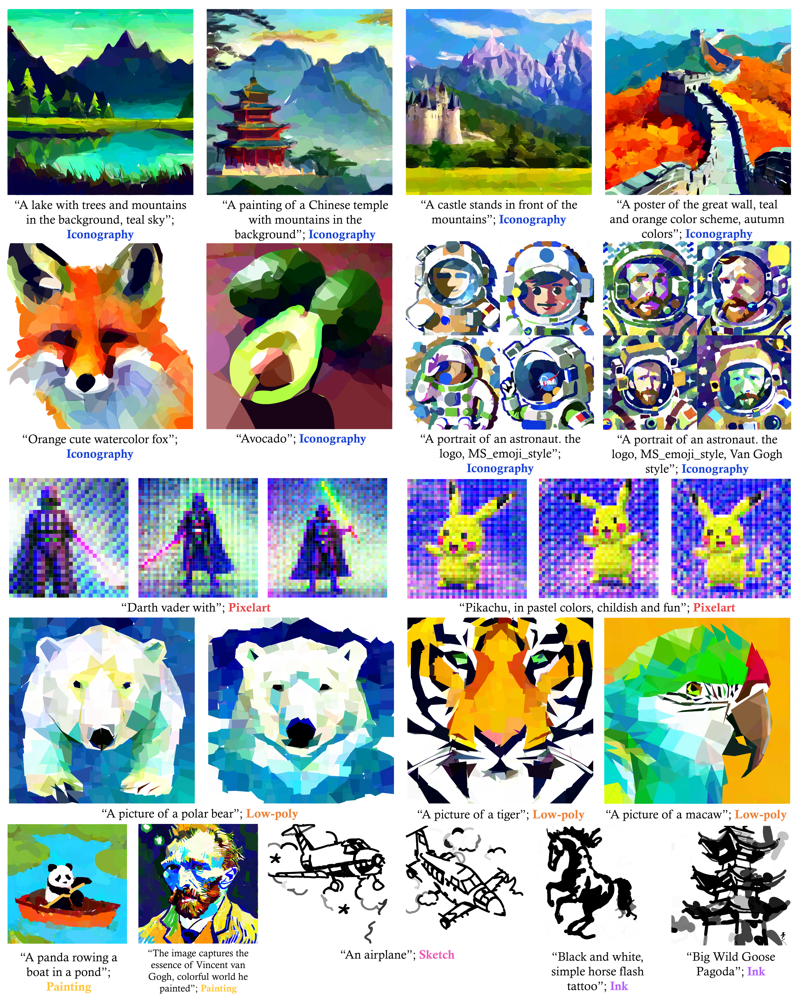
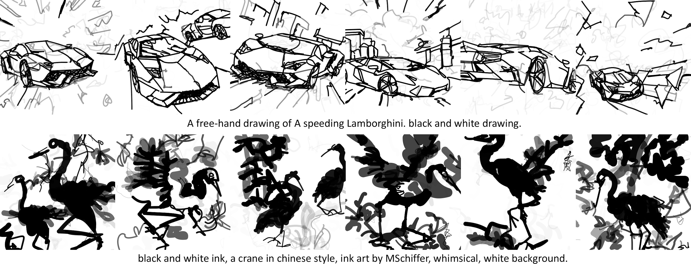

# DiffSketcher: Text Guided Vector Sketch Synthesis through Latent Diffusion Models

[](https://arxiv.org/abs/2312.16476)

### Code coming soon !!!

Our project page can be found [here](https://ximinng.github.io/DiffSketcher-project/).





### TODO

- [ ] release the complete code

## :books: Acknowledgement

The project is built based on the following repository:

- [BachiLi/diffvg](https://github.com/BachiLi/diffvg)
- [huggingface/diffusers](https://github.com/huggingface/diffusers)
- [ximinng/DiffSketcher](https://github.com/ximinng/DiffSketcher)

We gratefully thank the authors for their wonderful works.

## :paperclip: Citation

If you use this code for your research, please cite the following work:

```
@article{xing2023svgdreamer,
    title={SVGDreamer: Text Guided SVG Generation with Diffusion Model},
    author={Xing, Ximing and Zhou, Haitao and Wang, Chuang and Zhang, Jing and Xu, Dong and Yu, Qian},
    journal={arXiv preprint arXiv:2312.16476},
    year={2023}
}
```

## :copyright: Licence

This work is licensed under a MIT License.