# SVGDreamer: Text Guided SVG Generation with Diffusion Model

[](https://arxiv.org/abs/2312.16476)
[](https://arxiv.org/abs/2312.16476)
[](https://ximinng.github.io/SVGDreamer-project/)
[](https://huggingface.co/blog/xingxm/svgdreamer)
[](https://mp.weixin.qq.com/s/QEBiP-xLVvQVoV_9H2Id7g)

This repository contains the official implementation of our CVPR 2024 paper, "SVGDreamer: Text-Guided SVG Generation
with Diffusion Model." The method leverages a diffusion-based approach to produce high-quality SVGs guided by text
prompts.


## :new: Update

- [11/2024] 🔥 **We released the [SVGDreamer++](https://arxiv.org/abs/2411.17832), offering stronger visual representation and improved editing capabilities.**
- [03/2024] 🔥 We released the **code** for [SVGDreamer](https://ximinng.github.io/SVGDreamer-project/).
- [02/2024] 🎉 SVGDreamer accepted by CVPR2024. 🎉
- [12/2023] 🔥 We released the **[SVGDreamer Paper](https://arxiv.org/abs/2312.16476)**. SVGDreamer is
  a novel text-guided vector graphics synthesis method. This method considers both the editing of vector graphics and
  the quality of the synthesis.

## Installation

#### 1. Install Environment

You can follow the steps below to quickly get up and running with SVGDreamer.
These steps will let you run quick inference locally.

In the top level directory run,

```bash
sh script/install.sh
```

or using docker,

```shell
docker run --name svgdreamer --gpus all -it --ipc=host ximingxing/svgrender:v1 /bin/bash
```

#### 2. Download Pretrained Stable Diffusion Model

**Downloading pretrained SD models** by setting `diffuser.download=True` in `/conf/config.yaml` the first time you run
it.
(Alternatively, you can append `diffuser.download=True` to the end of the script.)

Or you can still download it manually,

- Model Link: https://huggingface.co/stabilityai/stable-diffusion-2-1-base
- Default model is stored in the `/home/user/.cache/huggingface/hub/models--stabilityai--stable-diffusion-2-1-base`

## 🔥 Quickstart: synthesize **6** SVGs at once 

### SIVE + VPSD

**Prompt:** an image of Batman. full body action pose, complete detailed body, white background, high quality, 4K, ultra
realistic <br/>
**Preview:**

|                  Particle 1                   |                  Particle 2                   |                  Particle 3                   |                  Particle 4                  |                  Particle 5                   |                  Particle 6                   |
|:---------------------------------------------:|:---------------------------------------------:|:---------------------------------------------:|:--------------------------------------------:|:---------------------------------------------:|:---------------------------------------------:|
|                    init p1                    |                    init p2                    |                    init p3                    |                   init p4                    |                    init p5                    |                    init p6                    |
|   | 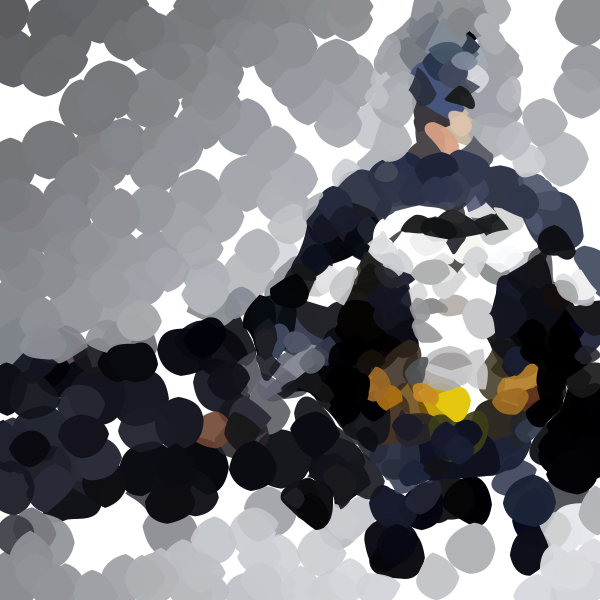  | 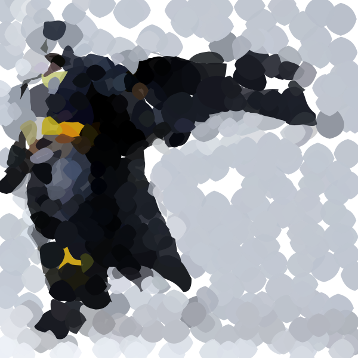  | 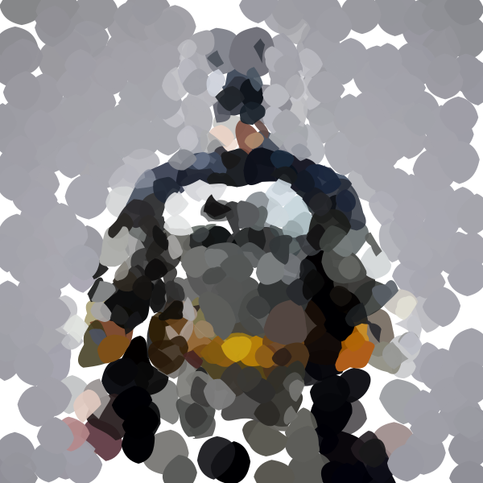 | 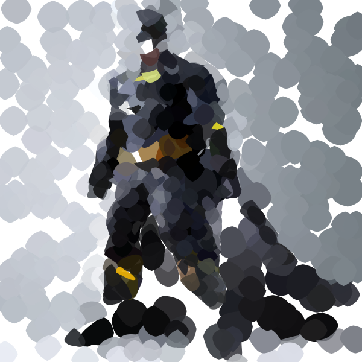  | 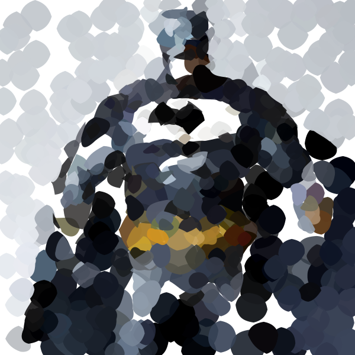  |
|                   final p1                    |                   final p2                    |                   final p3                    |                   final p4                   |                   final p5                    |                   final p6                    |
| 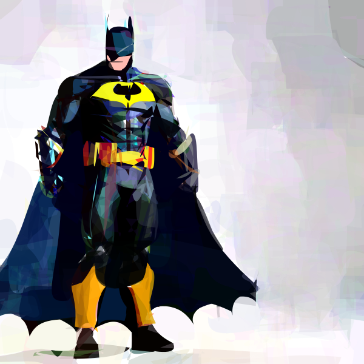 | 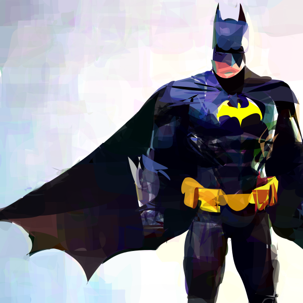 | 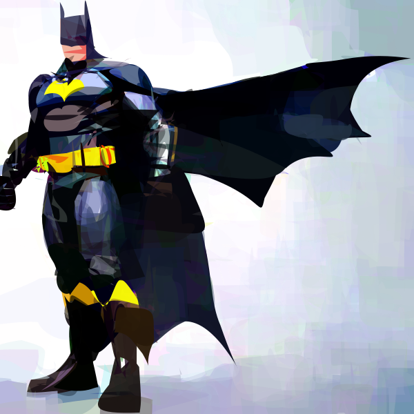 | 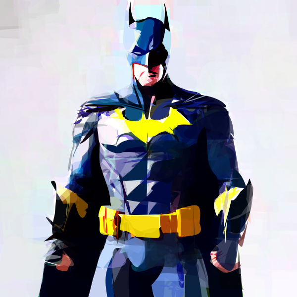  | 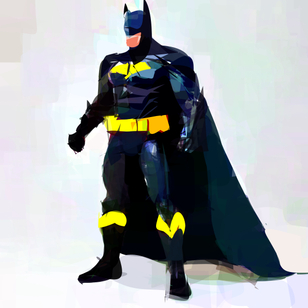 | 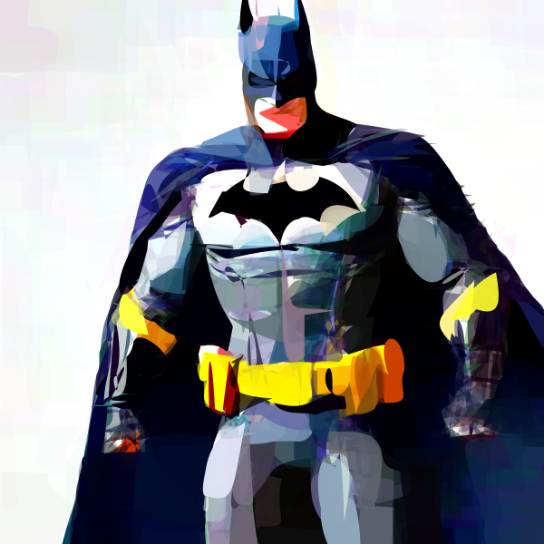 |

**Script:**

```shell
python svgdreamer.py x=iconography skip_sive=False "prompt='an image of Batman. full body action pose, complete detailed body. white background. empty background, high quality, 4K, ultra realistic'" token_ind=4 x.vpsd.t_schedule='randint' result_path='./logs/batman' multirun=True
```

- `x=iconography`(str): style configs
- `skip_sive`(bool): enable the SIVE stage
- `token_ind`(int): the index of text prompt, from 1
- `result_path`(str):  the path to save the result
- `multirun`(bool): run the script multiple times with different random seeds
- `mv`(bool): save the intermediate results of the run and record the video (This increases the run time)

More parameters in `./conf/x/style.yaml`, you can modify these parameters from the command line. For example,
append `x.vpsd.n_particle=4` to the end of the script.

### SIVE

**Prompt:** an astronaut walking across a desert, planet mars in the background, floating beside planets, space
art <br/>
**Preview:**

|                    attn-map                    |                      bg init                      |                      fg init                      |                      bg final                      |                      fg final                      |                      final                       |
|:----------------------------------------------:|:-------------------------------------------------:|:-------------------------------------------------:|:--------------------------------------------------:|:--------------------------------------------------:|:------------------------------------------------:|
|  |  |  | 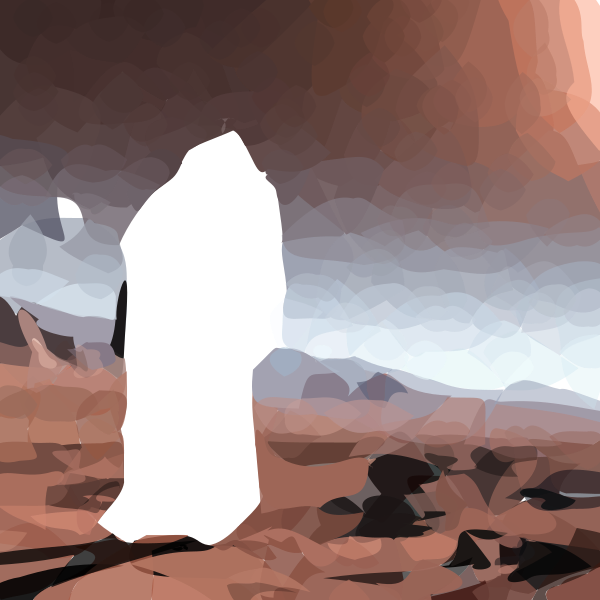 | 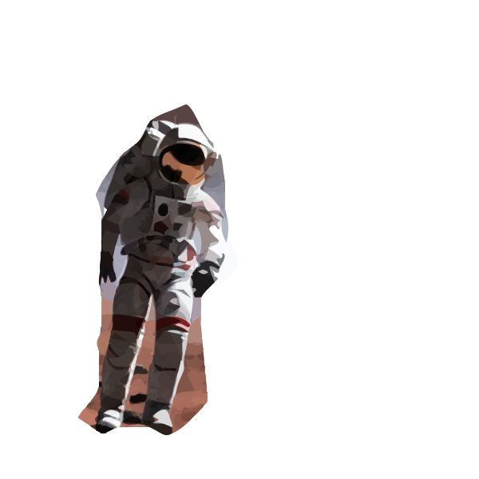 |  |

**Script:**

```shell
python svgdreamer.py x=iconography-s1 skip_sive=False "prompt='an astronaut walking across a desert, planet mars in the background, floating beside planets, space art'" token_ind=5 result_path='./logs/astronaut_sive' seed=116740
```

### VPSD

#### ✍️ Iconography style

**Prompt:** Sydney opera house. oil painting. by Van Gogh <br/>
**Preview:**

|                       Particle 1                       |                       Particle 2                       |                       Particle 3                       |                       Particle 4                       |                       Particle 5                       |                       Particle 6                       |
|:------------------------------------------------------:|:------------------------------------------------------:|:------------------------------------------------------:|:------------------------------------------------------:|:------------------------------------------------------:|:------------------------------------------------------:|
|                        init p1                         |                        init p2                         |                        init p3                         |                        init p4                         |                        init p5                         |                        init p6                         |
|  |  |  |  |  |  |
|                        final p1                        |                        final p2                        |                        final p3                        |                        final p4                        |                        final p5                        |                        final p6                        |
|      |      |      |        |      |      |

**Script:**

```shell
python svgdreamer.py x=iconography "prompt='Sydney opera house. oil painting. by Van Gogh'" result_path='./logs/SydneyOperaHouse-OilPainting' state.mprec='fp16'
```

#### ✍️ Painting style

**Prompt:** Abstract Vincent van Gogh Oil Painting Elephant, featuring earthy tones of green and brown <br/>
**Preview:**

|                     Particle 1                     |                     Particle 2                     |                     Particle 3                     |                     Particle 4                     |                     Particle 5                     |                     Particle 6                     |
|:--------------------------------------------------:|:--------------------------------------------------:|:--------------------------------------------------:|:--------------------------------------------------:|:--------------------------------------------------:|:--------------------------------------------------:|
|                      init p1                       |                      init p2                       |                      init p3                       |                      init p4                       |                      init p5                       |                      init p6                       |
|  |  |  |  |  |  |
|                      final p1                      |                      final p2                      |                      final p3                      |                      final p4                      |                      final p5                      |                      final p6                      |
|      |      |      |      |      |      |

**Script:**

```shell
python svgdreamer.py x=painting "prompt='Abstract Vincent van Gogh Oil Painting Elephant, featuring earthy tones of green and brown.'" x.num_paths=256 result_path='./logs/Elephant-OilPainting'
```

#### ✍️ Pixel-Art style

**Prompt:** Darth vader with lightsaber <br/>
**Preview:**

|                      Particle 1                      |                      Particle 2                      |                      Particle 3                      |                      Particle 4                      |                      Particle 5                      |                      Particle 6                      |
|:----------------------------------------------------:|:----------------------------------------------------:|:----------------------------------------------------:|:----------------------------------------------------:|:----------------------------------------------------:|:----------------------------------------------------:|
|                       init p1                        |                       init p2                        |                       init p3                        |                       init p4                        |                       init p5                        |                       init p6                        |
|  |  |  |  |  |  |
|                       final p1                       |                       final p2                       |                       final p3                       |                       final p4                       |                       final p5                       |                       final p6                       |
|       |       |       |       |       |       |

**Script:**

```shell
python svgdreamer.py x=pixelart "prompt='Darth vader with lightsaber.'" result_path='./logs/DarthVader'
```

#### ✍️Low-poly style

**Prompt:** A picture of a bald eagle. low-ploy. polygon. minimal flat 2d vector <br/>
**Preview:**

|                     Particle 1                     |                     Particle 2                     |                     Particle 3                     |                     Particle 4                     |                     Particle 5                     |                     Particle 6                     |
|:--------------------------------------------------:|:--------------------------------------------------:|:--------------------------------------------------:|:--------------------------------------------------:|:--------------------------------------------------:|:--------------------------------------------------:|
|                      init p1                       |                      init p2                       |                      init p3                       |                      init p4                       |                      init p5                       |                      init p6                       |
| 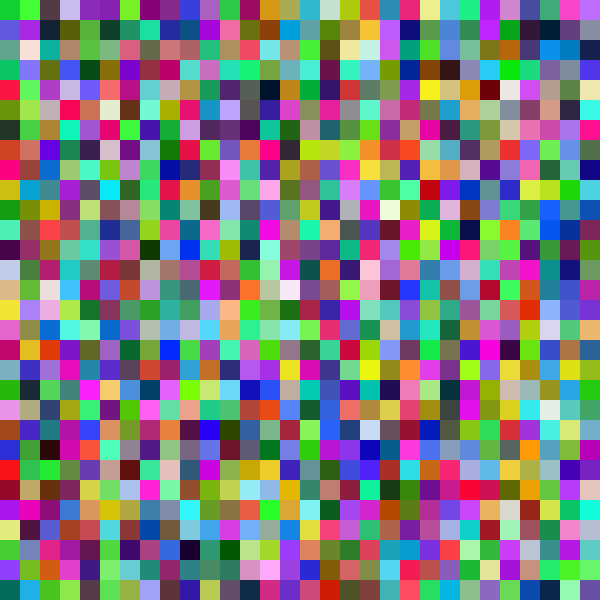 | 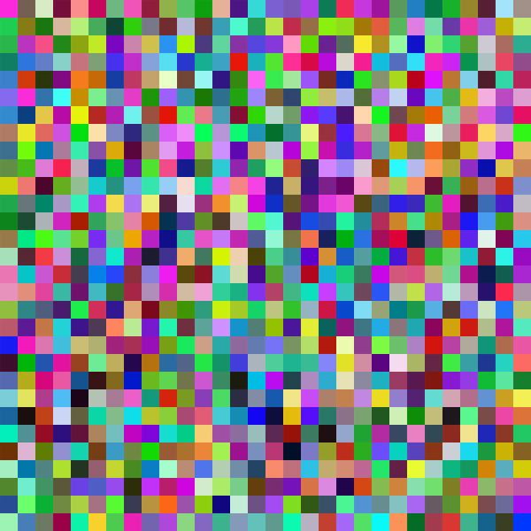 | 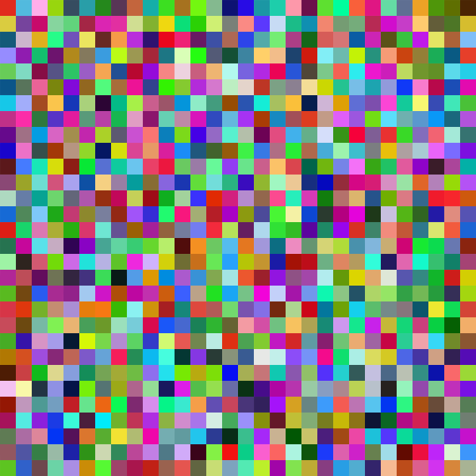 | 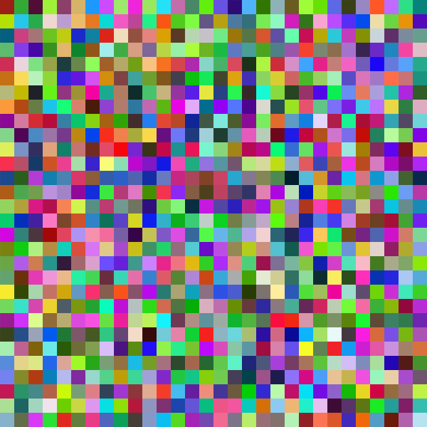 | 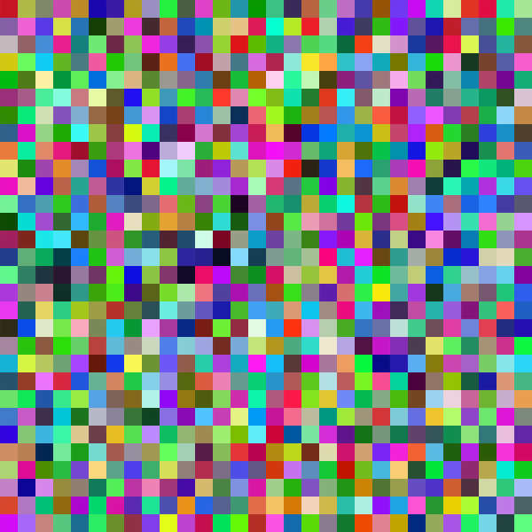 | 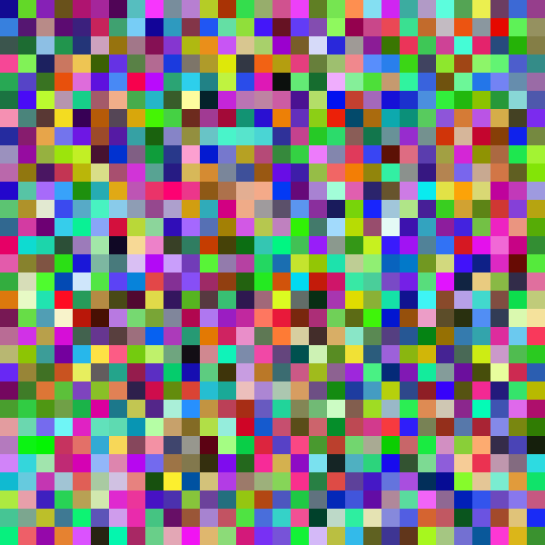 |
|                      final p1                      |                      final p2                      |                      final p3                      |                      final p4                      |                      final p5                      |                      final p6                      |
|   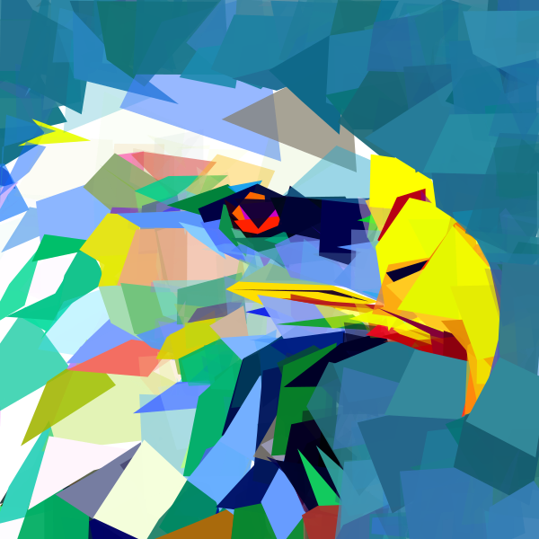    |   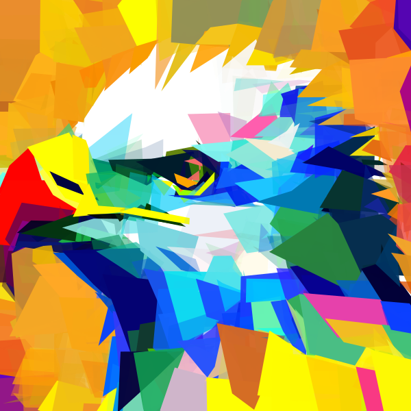    |   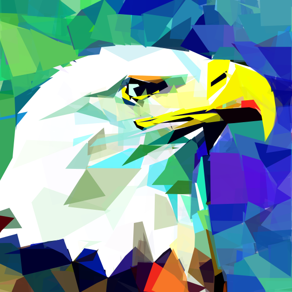    |   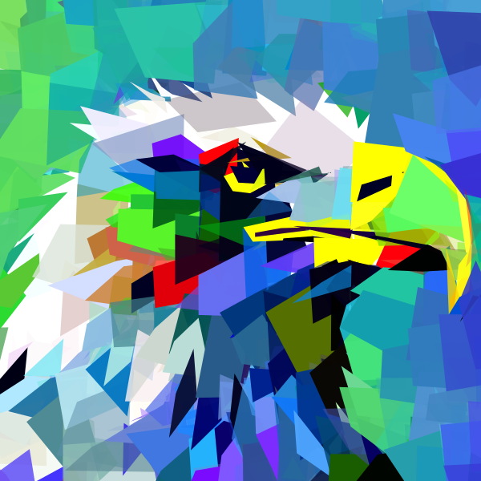    |   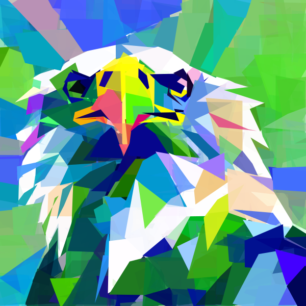    |   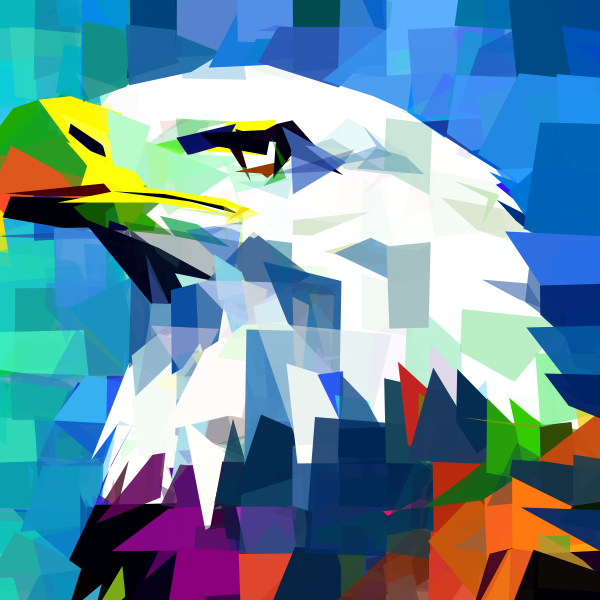    |

**Script:**

```shell
python svgdreamer.py x=lowpoly "prompt='A picture of a bald eagle. low-ploy. polygon. minimal flat 2d vector'" neg_prompt='' result_path='./logs/BaldEagle'
```

#### ✍️ Sketch style

**Prompt:** A free-hand drawing of A speeding Lamborghini. black and white drawing. <br/>
**Preview:**

|                     Particle 1                      |                     Particle 2                      |                     Particle 3                      |                     Particle 4                      |                     Particle 5                      |                     Particle 6                      |
|:---------------------------------------------------:|:---------------------------------------------------:|:---------------------------------------------------:|:---------------------------------------------------:|:---------------------------------------------------:|:---------------------------------------------------:|
|                       init p1                       |                       init p2                       |                       init p3                       |                       init p4                       |                       init p5                       |                       init p6                       |
|  |  |  |  |  |  |
|                      final p1                       |                      final p2                       |                      final p3                       |                      final p4                       |                      final p5                       |                      final p6                       |
|       |       |       |       |       |       |

**Script:**

```shell
python svgdreamer.py x=sketch "prompt='A free-hand drawing of A speeding Lamborghini. black and white drawing.'" neg_prompt='' result_path='./logs/Lamborghini'
```

#### ✍️ Ink and Wash style

**Prompt:** Big Wild Goose Pagoda. ink style. Minimalist abstract art grayscale watercolor. empty background <br/>
**Preview:**

|                       Particle 1                        |                       Particle 2                        |                       Particle 3                        |                       Particle 4                        |                       Particle 5                        |                       Particle 6                        |
|:-------------------------------------------------------:|:-------------------------------------------------------:|:-------------------------------------------------------:|:-------------------------------------------------------:|:-------------------------------------------------------:|:-------------------------------------------------------:|
|                         init p1                         |                         init p2                         |                         init p3                         |                         init p4                         |                         init p5                         |                         init p6                         |
|  |  |  |  |  |  |
|                        final p1                         |                        final p2                         |                        final p3                         |                        final p4                         |                        final p5                         |                        final p6                         |
|       |       |       |       |       |       |

**Script:**

```shell
python svgdreamer.py x=ink "prompt='Big Wild Goose Pagoda. ink style. Minimalist abstract art grayscale watercolor. empty background'" neg_prompt='' result_path='./logs/BigWildGoosePagoda'
```

#### More Cases

**See [Examples.md](https://github.com/ximinng/DiffSketcher/blob/main/Examples.md) for more cases.**

## 🔑 Tips

- I highly recommend turning on xformer `enable_xformers=True` to speed up optimization.
- `x.vpsd.t_schedule` greatly affects the style of the result. Please try more.
- `neg_prompt` negative prompts affect the quality of the results
- By setting `state.mprec='fp16'`, you can significantly reduce GPU memory usage.

## 📋 TODO

- [x] Release the code.
- [x] Add docker image.
- [x] Support fp16 optimization.

## :books: Acknowledgement

The project is built based on the following repository:

- [BachiLi/diffvg](https://github.com/BachiLi/diffvg)
- [huggingface/diffusers](https://github.com/huggingface/diffusers)
- [ximinng/DiffSketcher](https://github.com/ximinng/DiffSketcher)
- [THUDM/ImageReward](https://github.com/THUDM/ImageReward)
- [ximinng/PyTorch-SVGRender](https://github.com/ximinng/PyTorch-SVGRender)

We gratefully thank the authors for their wonderful works.

## :paperclip: Citation

If you use this code for your research, please cite the following work:

```
@InProceedings{svgdreamer_xing_2023,
    author    = {Xing, Ximing and Zhou, Haitao and Wang, Chuang and Zhang, Jing and Xu, Dong and Yu, Qian},
    title     = {SVGDreamer: Text Guided SVG Generation with Diffusion Model},
    booktitle = {Proceedings of the IEEE/CVF Conference on Computer Vision and Pattern Recognition (CVPR)},
    month     = {June},
    year      = {2024},
    pages     = {4546-4555}
}
```

## :copyright: Licence

This work is licensed under a MIT License.